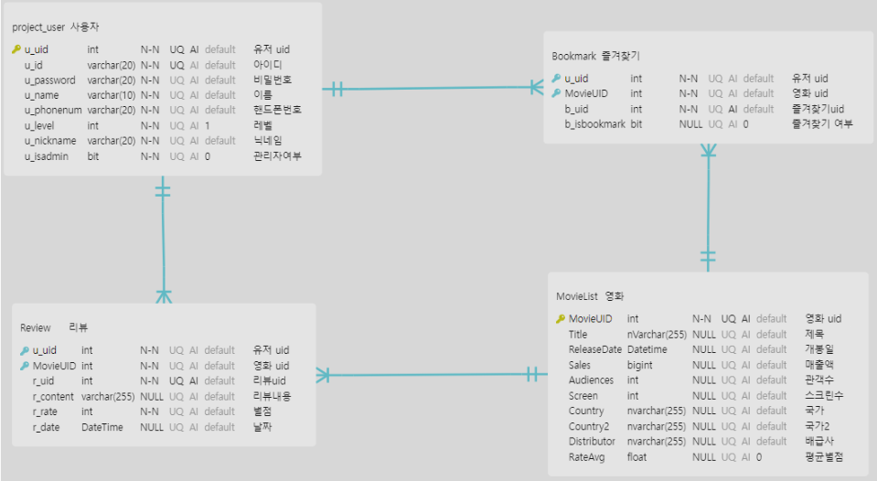
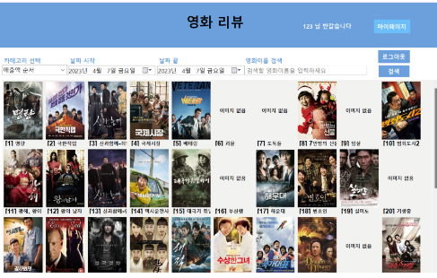
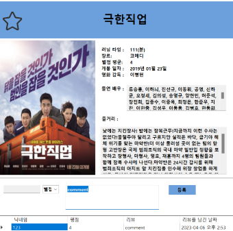
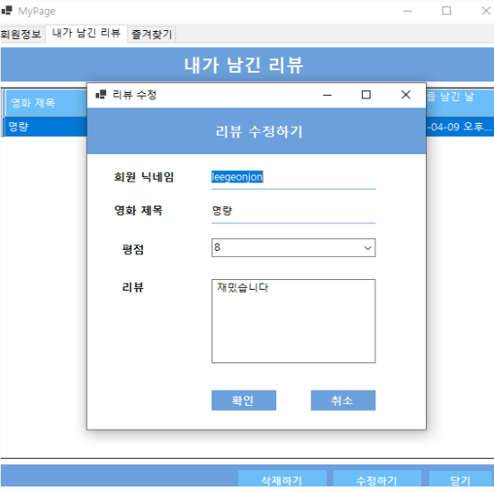
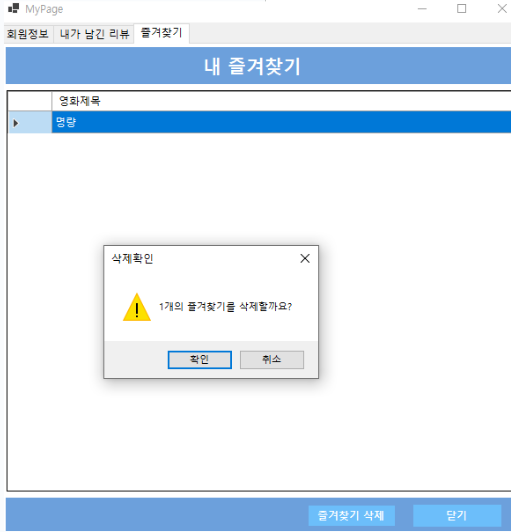
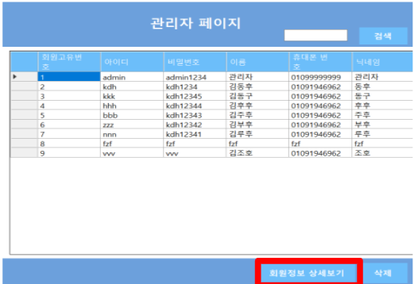

# **영화 리뷰 앱**
### **[ 시연 & 발표영상 Link ]**

 

[시연 & 발표영상 Link]:https://youtu.be/R2bu9cVhz_Q?list=PLedGoSru794_Yr2H12lOkCSZo3Y-VFaEk

## **개요**
- DB와 API를 활용하여 프로젝트 기간 내에 제작할 수 있는 Windows GUI 서비스앱 개발
- 회원 , 영화 리뷰에 대한 CRUD를 통해 DataBase에 데이터 저장 관리자 페이지를 통해 회원과 리뷰 관리 
- 영화 API를 활용하여 영화에 대한 상세정보를 불러오고 회원들은 리뷰를 작성할 수 있다.
  

## **개발 환경 및 활용 기술**
- C# 및 .NET 프레임워크, Winform을 활용한 앱 화면 구현
- MSSQL 데이터베이스 구축
- KMDB , 영화진흥위원회의 API 사용
  
## **공헌한 내용**
- 참여도 35%
- 영화 리뷰 앱 전반적인 디자인 
- 데이터베이스 설계 : 각 테이블 설계, 각 테이블들의 관계 설정
- API,데이터 선정: KMDB에서 영화 상세정보 데이터들을 가져오도록 했고 , 영화진흥위원회에서 영화 1000개의 목록을 가져오도록 함
- 관리자 페이지 구현 : 회원정보 관리할 수 있는 관리자 페이지 구현
- 마이페이지 구현 : 마이페이지에서 리뷰 , 즐겨찾기 보거나 수정할 수 있게 구현

### **데이터베이스 설계** 
- 4개의 테이블로 데이터베이스 설계

 

### **디자인**
- 메인페이지 디자인

 

- 영화 상세정보 디자인

 

### **마이페이지 일부 구현**

- 마이페이지 내 리뷰 즐겨찾기 관리 구현

 

### **관리자페이지 구현**

- 관리자페이지 구현

